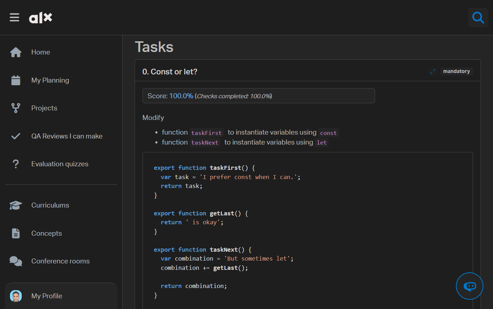

# ALX Intranet Themes & Tools

`Chrome Extension`

A Collection of Stunning Themes and Creative Tools
to Enhance Students Intranet Experience



Watch demo video: [https://www.youtube.com/watch?v=\_TzPtjjdMDY&t=16s](https://www.youtube.com/watch?v=_TzPtjjdMDY&t=16s)

<hr />

📢 Before diving into the details, I want to clarify something important: I’ve made it incredibly easy for students to contribute and create their own themes. You only need to add a single JSON file containing the theme's color palette and the extension will handle the rest! [_Check how to add your own theme_](#contribution)

## Table of Contents

- [Overview](#overview)
- [Features](#features)
- [Technologies](#technologies)
- [Installation](#installation)
- [Development](#development)
- [Contribution](#contribution)
- [Contact](#contact-me)

## Overview

The journey of studying at ALX has been truly amazing, and now we’re at the final milestone. To me, it feels like saying a hard goodbye to something that’s been a part of my life every day for the past year. That’s why I wanted to give something back to the community. I decided to create a project related to the school. The intranet, where we spent almost every day, felt like a safe space, and I’m grateful because it made learning smooth and easy. This project is inspired by someone who created a similar tool, but I want to take it further and add my own ideas. I aim to add features we always wished the intranet had. I hope it will be a blessing for the next cohorts.

## Features

✅ **Stunning Themes** _(8 well-crafted themes and yours could be next!)_ \
✅ **In-Task Code Highlighting**\
✅ **Modern UI**\
✅ **Focus Mode**

## Technologies

- `React.js` with `TypeScript`
- `Tailwind CSS`
- `Shadcn/ui` components
- `JavaScript` libraries (_Highlight.js_)

> Note: You might be wondering why I used React.js and all these tools when I could have achieved the same result with vanilla JavaScript and a bit of CSS. The reason is that I wanted to apply what we've learned while also delivering a better product. Plus, don’t worry—it's not as complicated as it seems! React.js is only used for building the popup UI. I’ve made sure contributing is super simple for other students to create their own themes—literally by just adding one JSON file with the theme’s color palette. [_Check how to contribute_](#contribution)

## Installation

### Method 1: `Manually`

1. **Download the ZIP File:** Get the latest version of the extension from the [Releases](https://github.com/EL-OUARDY/alx-holberton-intranet-themes/releases) page.
2. **Extract the Files:** Unzip the downloaded file to a folder on your computer.
3. **Load the Extension in Chrome:**
   - Open Chrome and navigate to `chrome://extensions/`
   - Enable **Developer mode** by toggling the switch in the top right corner.
   - Click on **Load unpacked** and select the folder where you extracted the files.
4. **Enjoy the Extension**: It should now be installed and ready to use!

### Method 2: `Chrome Web Store`

The extension is now available on the Chrome Web Store. [_click here_](https://chromewebstore.google.com/detail/alx-holberton-themes-code/emoclfafkepielodpfejpicjoamogjha)

## Development

This guide is designed for developers who are new to Chrome extension development. We'll walk through each step to help you get started!

### Setting Up Development Environment

1. **Clone Your Forked Repository**

   ```bash
   git clone https://github.com/your-username/alx-holberton-intranet-themes
   ```

2. **Install Node Dependencies**
   ```bash
   npm install
   ```
3. **Start Development Mode**

   ```bash
   npm run dev
   ```

   This command will:

   - Build the extension code
   - Watch for changes and rebuild automatically
   - Output the built files to the `/dist` directory

4. **Load the Extension in Chrome**:
   - Open Chrome and navigate to `chrome://extensions/`
   - Enable **Developer mode** in the top right corner
   - Click **Load unpacked**
   - Select the `/dist` directory from your project folder

### Important Development Notes

The project uses `React.js` for the popup UI, with the core extension functionality implemented in TypeScript.

#### Hot Reload Behavior:

- Changes to popup UI code (React components) will update automatically

- Changes to `content.ts`, `background.ts`, or files in `/public` _(including themes)_ require manually **reloading** the extension from chrome settings.

#### Key Files:

- `content.ts`: Handles DOM modifications and theme application

- `background.ts`: Manages extension lifecycle and events

- `Files in /public`: Contains extension manifest and static assets

### Project Structure

Here's an overview of key files and directories:

```bash
├── src/
│   ├── content.ts     # Content script for page modifications
│   └── background.ts  # Background script for extension events
│
├── public/           # Static assets and extension files
└── dist/            # Built extension files (generated)
```

## Contribution

If you’d like to add your own theme, simply create a `JSON` file that contains details about your theme, such as colors and other relevant information (see this [\_example.json](./public/themes/_example.json)). The extension is configured to automatically load themes from this directory, so you don’t have to worry about any additional setup.
Remember, adding a file/theme to the extension folder will require you to reload the extension from the Chrome settings.

### Adding Features

To add features to the extension please follow these steps:

1. **Fork the Repository**:

   - Start by forking the repository on GitHub to your own account.

2. **Clone Your Fork**:

   - Clone your forked repository to your local machine:
     ```bash
     git clone https://github.com/your-username/alx-holberton-intranet-themes
     ```

3. **Create a New Branch**:

   - Navigate to the project directory:
     ```bash
     cd alx-intranet-themes-tools
     ```
   - Create a new branch for your feature:
     ```bash
     git checkout -b feature/your-feature-name
     ```

4. **Implement Your Feature**:

   - Make the necessary changes in the code to add your desired feature.
   - Be sure to test your changes locally to ensure everything works as expected.

5. **Commit Your Changes**:

   - Once you’re satisfied with your feature, commit your changes:
     ```bash
     git add .
     git commit -m "a clear and descriptive message about your feature or changes"
     ```

6. **Push to Your Fork**:

   - Push your changes to your forked repository:
     ```bash
     git push origin feature/your-feature-name
     ```

7. **Open a Pull Request**:
   - Go to the original repository on GitHub and open a pull request from your feature branch. Provide a brief description of the changes you made and why they should be merged.

## Acknowledgments

Thanks to the `ALX`/`Holberton` community for inspiration and support.

## Contact Me

**Email:** ouadia@elouardy.com \
**Twitter:** https://twitter.com/_ELOUARDY
